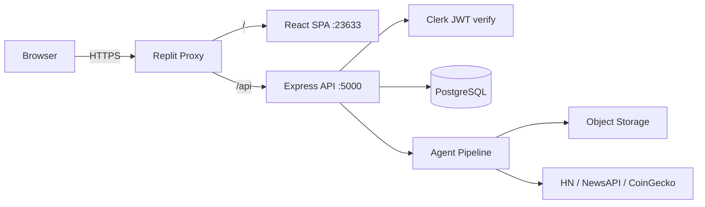

# Synaptiq

> **Synaptic Applications** — AI-native knowledge graph, agent pipeline, and analytics platform.

[](https://github.com/Itkdaniel/portfolio-project/actions/workflows/ci.yml)
[](https://github.com/Itkdaniel/portfolio-project/actions/workflows/codeql.yml)
[](LICENSE)

Synaptiq is a full-stack intelligence platform that scrapes live trending-topic data (tech, news, crypto, stocks, sports), processes and trains lightweight AI models on it, visualizes its own relational data as a live force-directed knowledge graph, manages a team portfolio/resume directory, and surfaces a color-coded test-suite dashboard — all behind Clerk authentication and role-based access control.

---

## Table of Contents

- [Features](#features)
- [Tech Stack](#tech-stack)
- [Repository Structure](#repository-structure)
- [Architecture](#architecture)
- [Getting Started](#getting-started)
  - [Prerequisites](#prerequisites)
  - [Local Development (Replit)](#local-development-replit)
  - [Local Development (Self-hosted)](#local-development-self-hosted)
  - [Docker Compose](#docker-compose)
- [Environment Variables](#environment-variables)
  - [Development](#development)
  - [Production](#production)
- [CI/CD Pipelines](#cicd-pipelines)
  - [CI — Typecheck, Lint & Test](#ci--typecheck-lint--test)
  - [CD — Production Deploy](#cd--production-deploy)
  - [Security Scan — CodeQL](#security-scan--codeql)
  - [Required GitHub Secrets](#required-github-secrets)
- [Database Migrations](#database-migrations)
- [API Reference](#api-reference)
- [Testing](#testing)
- [Utility Scripts](#utility-scripts)
- [Docker & Container Builds](#docker--container-builds)
- [Deployment Methods](#deployment-methods)
  - [Replit Deployments (primary)](#replit-deployments-primary)
  - [Docker / Railway / Fly.io](#docker--railway--flyio)
  - [Static Frontend (Vercel / Netlify)](#static-frontend-vercel--netlify)
- [Security Protocols](#security-protocols)
- [Release History](#release-history)
- [License](#license)
- [Copyright](#copyright)

---

## Features

| Feature | Description |
|---------|-------------|
| **Auth & RBAC** | Clerk-powered sign-in/sign-up; first-ever user auto-promoted to admin |
| **Dashboard** | Live overview of pipeline activity, data sources, and team directory |
| **Agent Pipeline** | Scrape → Process → Train on real public data (Hacker News, NewsAPI, CoinGecko) |
| **Knowledge Graph** | Canvas-based force-directed live graph of the platform's own relational data |
| **Team Profiles** | Resume/portfolio pages per user; public and private views |
| **Test Dashboard** | Color-coded progress bars per suite category (unit/DDT/BDD/regression/E2E) |
| **Admin Panel** | Role management, user list, admin-gated actions |
| **CLI Tool** | `pnpm --filter @workspace/scripts run agent -- --scrape=<src> --process=<id> --train=<id>` |

---

## Tech Stack

| Layer | Technology |
|-------|-----------|
| Language | TypeScript 5.9, Go (future), Python (future) |
| Runtime | Node.js 24 |
| Frontend | React 18, Vite 6, Wouter, React Query (TanStack), shadcn/ui |
| Backend | Express 5, Pino logger |
| Auth | Clerk (JWT, OIDC) |
| Database | PostgreSQL 16 + Drizzle ORM |
| Validation | Zod v4, drizzle-zod |
| API Codegen | Orval (OpenAPI 3.1 → React Query hooks + Zod schemas) |
| Build | esbuild (API), Vite (SPA) |
| Monorepo | pnpm workspaces |
| Testing | Vitest (unit/DDT/BDD/regression/E2E) — Page Object Model + Factory pattern |
| CI/CD | GitHub Actions |
| Security | CodeQL, pnpm minimumReleaseAge, Nginx security headers, Clerk JWT |
| Container | Docker multi-stage, Docker Compose, Nginx |
| Storage | Replit Object Storage |

---

## Repository Structure

```
synaptiq/                          # pnpm monorepo root
├── artifacts/
│   ├── api-server/                # Express 5 REST API (TypeScript → esbuild CJS)
│   │   └── src/
│   │       ├── app.ts             # Express app factory
│   │       ├── routes/            # Route handlers per domain
│   │       ├── middlewares/       # Auth (Clerk), RBAC, Clerk proxy
│   │       ├── lib/               # Logger, ObjectStorage
│   │       └── tests/             # Vitest test suites (5 categories)
│   └── platform/                  # React SPA (Vite)
│       └── src/
│           ├── App.tsx            # Clerk provider + Wouter routing
│           ├── pages/             # Dashboard, Pipeline, KnowledgeGraph, etc.
│           ├── components/        # Layout, shared UI components
│           └── hooks/             # Custom React hooks
├── lib/
│   ├── agent-pipeline/            # Scrape / process / train logic
│   ├── api-client-react/          # Generated React Query hooks (Orval)
│   ├── api-spec/                  # OpenAPI 3.1 spec (source of truth)
│   ├── api-zod/                   # Generated Zod validation schemas
│   ├── db/                        # Drizzle schema + db client
│   └── object-storage-web/        # Replit object storage wrapper
├── scripts/
│   └── src/agentCli.ts            # CLI: --scrape / --process / --train
├── utils/                         # Dev utility scripts (bash + PowerShell)
│   ├── setup.sh                   # One-shot local setup (macOS/Linux)
│   ├── setup.ps1                  # One-shot local setup (Windows)
│   ├── db-migrate.sh              # Push Drizzle schema changes
│   ├── run-tests.sh               # Run test suites
│   └── codegen.sh                 # Regenerate API client from OpenAPI spec
├── docker/
│   ├── docker-compose.yml         # Local full-stack (Postgres + API + Nginx)
│   └── nginx.conf                 # SPA routing + security headers
├── docs/
│   ├── architecture.md            # Mermaid system diagrams
│   ├── api.md                     # API endpoint reference
│   └── testing.md                 # Test strategy, POM, factory pattern
├── .github/
│   └── workflows/
│       ├── ci.yml                 # CI: typecheck + test + build
│       ├── deploy-production.yml  # CD: deploy on push to main
│       └── codeql.yml             # Security: CodeQL SAST scan
├── Dockerfile                     # Multi-stage Docker build (API + Nginx)
├── .env.example                   # Environment variable template
├── LICENSE                        # MIT License
└── README.md                      # This file
```

---

## Architecture

See [`docs/architecture.md`](docs/architecture.md) for full Mermaid diagrams covering:

- **System overview** — proxy routing, service boundaries
- **Agent pipeline data flow** — scrape → process → train sequence diagram
- **Auth & RBAC flow** — JWT verification, role resolution, first-admin promotion
- **Database schema** — all tables and relations (ER diagram)
- **Knowledge graph schema** — node/edge model

### Quick overview



---

## Getting Started

### Prerequisites

| Tool | Version | Install |
|------|---------|---------|
| Node.js | 24+ | [nodejs.org](https://nodejs.org) |
| pnpm | 9+ | `npm i -g pnpm@9` |
| PostgreSQL | 16+ | [postgresql.org](https://www.postgresql.org) or Docker |
| Git | 2.40+ | [git-scm.com](https://git-scm.com) |

### Local Development (Replit)

Replit provisions all services automatically. The three workflows run in parallel:

```
artifacts/api-server: API Server      → pnpm --filter @workspace/api-server run dev
artifacts/platform: web               → pnpm --filter @workspace/platform run dev
```

Required Replit Secrets (set via the Secrets panel):

```
DATABASE_URL
SESSION_SECRET
CLERK_SECRET_KEY
CLERK_PUBLISHABLE_KEY
VITE_CLERK_PUBLISHABLE_KEY
DEFAULT_OBJECT_STORAGE_BUCKET_ID
PRIVATE_OBJECT_DIR
PUBLIC_OBJECT_SEARCH_PATHS
```

### Local Development (Self-hosted)

```bash
# 1. Clone
git clone https://github.com/Itkdaniel/portfolio-project.git
cd portfolio-project

# 2. One-shot setup (installs deps, creates .env.local)
chmod +x utils/setup.sh && ./utils/setup.sh     # macOS / Linux
# or on Windows PowerShell 7+:
.\utils\setup.ps1

# 3. Fill in .env.local with real values (see Environment Variables below)
cp .env.example .env.local
nano .env.local

# 4. Push DB schema (first run only)
./utils/db-migrate.sh

# 5. Start API server (terminal 1)
pnpm --filter @workspace/api-server run dev

# 6. Start frontend (terminal 2)
pnpm --filter @workspace/platform run dev

# Open http://localhost:23633
```

### Docker Compose

Full stack in one command (Postgres + API + Nginx frontend):

```bash
# Build and start all services
docker compose -f docker/docker-compose.yml up --build

# Stop
docker compose -f docker/docker-compose.yml down

# Open http://localhost:8080
```

Required env vars for Docker (set in shell before running):

```bash
export SESSION_SECRET=<64-char-hex>
export CLERK_SECRET_KEY=sk_live_...
export CLERK_PUBLISHABLE_KEY=pk_live_...
```

---

## Environment Variables

### Development

| Variable | Required | Description |
|----------|----------|-------------|
| `DATABASE_URL` | ✅ | PostgreSQL connection string |
| `SESSION_SECRET` | ✅ | 64-char random hex (`openssl rand -hex 32`) |
| `CLERK_SECRET_KEY` | ✅ | Clerk server-side secret key |
| `CLERK_PUBLISHABLE_KEY` | ✅ | Clerk publishable key |
| `VITE_CLERK_PUBLISHABLE_KEY` | ✅ | Clerk publishable key (browser bundle) |
| `DEFAULT_OBJECT_STORAGE_BUCKET_ID` | ✅ | Replit object storage bucket ID |
| `PRIVATE_OBJECT_DIR` | ⚪ | Sub-directory for private files (default: `private`) |
| `PUBLIC_OBJECT_SEARCH_PATHS` | ⚪ | Comma-separated public paths (default: `public`) |
| `PORT` | ⚪ | API server port (default: `5000`; set by Replit workflow) |

### Production

Same variables as development, plus these additional guards:

| Variable | Description |
|----------|-------------|
| `NODE_ENV` | Must be `production` |
| `DATABASE_URL` | Use a production-grade managed Postgres (Neon, Supabase, RDS) |

Copy `.env.example` as your template. **Never commit `.env` files with real secrets.**

---

## CI/CD Pipelines

### CI — Typecheck, Lint & Test

File: `.github/workflows/ci.yml`
Triggers: push or PR to `main` / `dev`

```
install → typecheck → test → build (on main)
```

- `install`: pnpm install with frozen lockfile
- `typecheck`: `pnpm run typecheck` (all workspace packages)
- `test`: Vitest suites (unit/DDT/BDD/regression/E2E) — 21 tests, 5 categories
- `build`: esbuild API bundle + Vite SPA, uploads dist artifacts

### CD — Production Deploy

File: `.github/workflows/deploy-production.yml`
Triggers: push to `main` (after CI passes), or manual `workflow_dispatch`

```
install → build → db-migrate → deploy
```

Supports two deploy targets (uncomment the relevant block in the workflow):

1. **Replit Deployments** — via `@replit/deploy-action`
2. **Docker / GHCR** — build + push image, deploy to Railway/Fly.io/ECS

### Security Scan — CodeQL

File: `.github/workflows/codeql.yml`
Triggers: push/PR to `main`/`dev`, weekly Sunday 03:00 UTC

Runs GitHub CodeQL with `security-extended` + `security-and-quality` query suites on the TypeScript codebase.

### Required GitHub Secrets

Set these under **Settings → Secrets and variables → Actions → Repository secrets**:

| Secret | Description |
|--------|-------------|
| `DATABASE_URL` | Production PostgreSQL connection string |
| `SESSION_SECRET` | 64-char random hex |
| `CLERK_SECRET_KEY` | Clerk secret key |
| `CLERK_PUBLISHABLE_KEY` | Clerk publishable key |
| `VITE_CLERK_PUBLISHABLE_KEY` | Clerk publishable key (Vite build) |
| `DEFAULT_OBJECT_STORAGE_BUCKET_ID` | Object storage bucket |
| `REPLIT_TOKEN` | (optional) For Replit deploy action |

---

## Database Migrations

Synaptiq uses [Drizzle ORM](https://orm.drizzle.team) with a push-based workflow (no migration files — schema is source of truth).

```bash
# Development push
pnpm --filter @workspace/db run push

# Or via helper script
./utils/db-migrate.sh

# Production push (with safety confirmation prompt)
ENV=prod ./utils/db-migrate.sh
```

Schema source of truth: `lib/db/src/schema/`

---

## API Reference

See [`docs/api.md`](docs/api.md) for full endpoint documentation.

Full OpenAPI 3.1 spec: `lib/api-spec/openapi.yaml`

To regenerate client hooks and Zod schemas after editing the spec:

```bash
pnpm --filter @workspace/api-spec run codegen
# or
./utils/codegen.sh
```

---

## Testing

See [`docs/testing.md`](docs/testing.md) for the full testing guide including the Page Object Model and factory pattern documentation.

```bash
# Run all 5 suite categories (21 tests)
pnpm --filter @workspace/api-server run test

# Run via helper (with optional suite filter)
./utils/run-tests.sh
SUITE=bdd ./utils/run-tests.sh
```

Test categories:

| Suite | Focus |
|-------|-------|
| `unit` | Pure function / business logic |
| `ddt` | Data-Driven Tests — multiple input sets |
| `bdd` | Behaviour scenarios (Given / When / Then) |
| `regression` | Previous bug reproducers |
| `e2e` | Full HTTP stack against Express router |

---

## Utility Scripts

All scripts live in `utils/`. Make them executable with `chmod +x utils/*.sh`.

| Script | Platform | Description |
|--------|----------|-------------|
| `utils/setup.sh` | macOS/Linux | One-shot dev environment setup |
| `utils/setup.ps1` | Windows (PS7+) | One-shot dev environment setup |
| `utils/db-migrate.sh` | macOS/Linux | Push Drizzle schema changes |
| `utils/run-tests.sh` | macOS/Linux | Run Vitest suites |
| `utils/codegen.sh` | macOS/Linux | Regenerate API client from OpenAPI spec |

### CLI Agent

```bash
# Scrape a live data source (hacker-news, coin-gecko, crypto-panic)
pnpm --filter @workspace/scripts run agent -- --scrape=hacker-news --path=./data/raw

# Process scraped data into feature CSV
pnpm --filter @workspace/scripts run agent -- --process=./data/raw/hacker-news-*.ndjson --features=title,score,category

# Train on feature CSV
pnpm --filter @workspace/scripts run agent -- --train=./data/features/features-*.csv
```

---

## Docker & Container Builds

```bash
# Build API server image
docker build --target api-server -t synaptiq-api .

# Build frontend (Nginx static) image
docker build --target frontend -t synaptiq-web .

# Run API server container
docker run -p 5000:5000 \
  -e DATABASE_URL=postgresql://... \
  -e CLERK_SECRET_KEY=sk_live_... \
  -e SESSION_SECRET=<hex> \
  synaptiq-api

# Run frontend container
docker run -p 8080:80 synaptiq-web
```

See `docker/docker-compose.yml` for the full local stack.

---

## Deployment Methods

### Replit Deployments (primary)

1. Push changes to `main`
2. The CD workflow builds and deploys via `@replit/deploy-action`
3. Replit handles TLS, health checks, and autoscaling
4. Configure production secrets in Replit Secrets panel (NOT in `.env` files)

### Docker / Railway / Fly.io

```bash
# 1. Build and push image to GHCR
docker build --target api-server -t ghcr.io/itkdaniel/portfolio-project:latest .
docker push ghcr.io/itkdaniel/portfolio-project:latest

# 2. Deploy on Railway
railway up

# 3. Deploy on Fly.io
fly deploy
```

Uncomment the Docker steps in `.github/workflows/deploy-production.yml` to
automate image builds and pushes on every push to `main`.

### Static Frontend (Vercel / Netlify)

The Vite SPA output (`artifacts/platform/dist/public`) can be deployed
independently to any static host:

```bash
# Build frontend
pnpm --filter @workspace/platform run build

# Deploy to Vercel
npx vercel artifacts/platform/dist/public --prod

# Deploy to Netlify
npx netlify deploy --dir=artifacts/platform/dist/public --prod
```

> **Note**: When deploying the frontend separately, set `VITE_API_BASE_URL`
> to point to your deployed API server URL.

---

## Security Protocols

| Protocol | Implementation |
|----------|----------------|
| Authentication | Clerk JWTs — verified server-side on every protected request |
| Authorization | `requireAuth` + `requireAdmin` Express middleware; RBAC enforced per route |
| Transport security | HTTPS enforced (Replit proxy + Nginx TLS headers in production) |
| Supply-chain protection | `minimumReleaseAge: 1440` in `pnpm-workspace.yaml` — packages must be 24h old before install |
| SAST | GitHub CodeQL — runs on push, PR, and weekly |
| Secret management | Replit Secrets (dev), GitHub Secrets (CI/CD) — never committed to source |
| Database access | Server-only via Drizzle; PostgreSQL not exposed to browser or public network |
| HTTP security headers | Nginx: X-Frame-Options, X-Content-Type-Options, X-XSS-Protection, CSP, Referrer-Policy |
| Container security | Non-root user (`synaptiq`), minimal Alpine base, HEALTHCHECK, no shell in prod image |
| Dependency integrity | pnpm frozen lockfile in all CI steps (`--frozen-lockfile`) |
| CORS | Credentials + same-origin policy via Replit reverse proxy |

---

## Release History

### v1.0.0 — 2026-07-12

Initial release of Synaptiq (formerly Nexus Platform).

**What's included:**

- Full-stack monorepo (pnpm workspaces, TypeScript 5.9, Node.js 24)
- Express 5 REST API with Clerk auth + RBAC
- React 18 SPA: Dashboard, Pipeline, Knowledge Graph, Tests, Team, Profile, Admin
- AI agent pipeline: scrape → process → train (Hacker News, CoinGecko, Crypto Panic)
- Canvas-based force-directed knowledge graph viewer
- 5-category Vitest test suite (21 tests: unit/DDT/BDD/regression/E2E)
- GitHub Actions CI/CD (ci.yml, deploy-production.yml, codeql.yml)
- Docker multi-stage build (API + Nginx frontend)
- Docker Compose for local full-stack development
- Utility scripts: setup, migrate, test, codegen (bash + PowerShell)
- MIT License

**Downloadable assets** (see [Releases](https://github.com/Itkdaniel/portfolio-project/releases/tag/v1.0.0)):

| Asset | Platform | Description |
|-------|----------|-------------|
| `synaptiq-api-linux-amd64.tar.gz` | Linux x86_64 | API server bundle |
| `synaptiq-api-linux-arm64.tar.gz` | Linux ARM64 | API server bundle |
| `synaptiq-api-darwin-amd64.tar.gz` | macOS Intel | API server bundle |
| `synaptiq-api-darwin-arm64.tar.gz` | macOS Apple Silicon | API server bundle |
| `synaptiq-api-windows-amd64.zip` | Windows x86_64 | API server bundle |
| `synaptiq-web.tar.gz` | Any | Static frontend (deploy to any web server) |
| `docker-compose.yml` | Any | Docker Compose stack |
| `Source code (zip)` | Any | Full monorepo source |
| `Source code (tar.gz)` | Any | Full monorepo source |

**Installation from release bundle (Linux/macOS):**

```bash
# Download and extract
curl -L https://github.com/Itkdaniel/portfolio-project/releases/download/v1.0.0/synaptiq-api-linux-amd64.tar.gz | tar xz
cd synaptiq-api

# Set environment variables
export DATABASE_URL=postgresql://...
export CLERK_SECRET_KEY=sk_live_...
export SESSION_SECRET=$(openssl rand -hex 32)
export PORT=5000

# Run
node server.cjs
```

**Installation from release bundle (Windows):**

```powershell
# Download and extract
Expand-Archive synaptiq-api-windows-amd64.zip -DestinationPath synaptiq-api
Set-Location synaptiq-api

# Set environment variables
$env:DATABASE_URL = "postgresql://..."
$env:CLERK_SECRET_KEY = "sk_live_..."
$env:SESSION_SECRET = (New-Guid).ToString("N") + (New-Guid).ToString("N")
$env:PORT = "5000"

# Run
node server.cjs
```

---

## License

This project is licensed under the [MIT License](LICENSE).

---

## Copyright

Copyright (c) 2026 **Synaptic Applications** (Itkdaniel).

All source files carry the copyright notice:

```
// Copyright (c) 2026 Synaptic Applications (Itkdaniel). MIT License.
```
