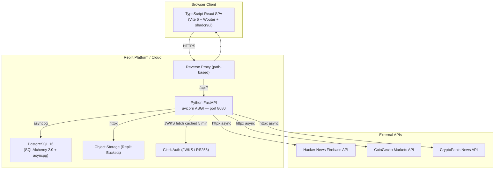
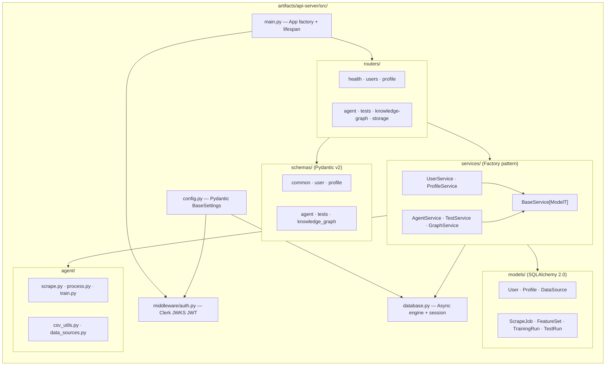
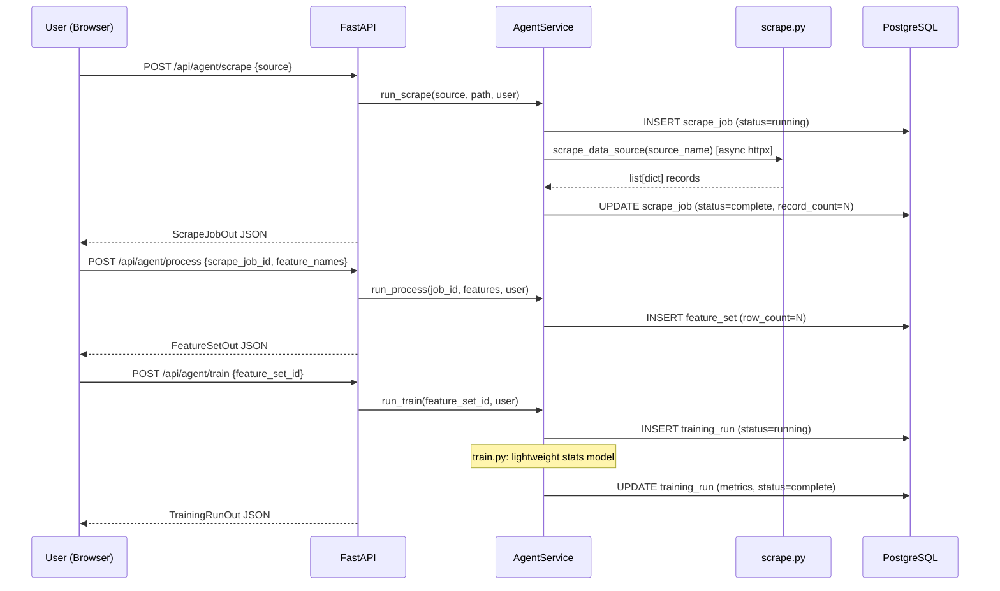
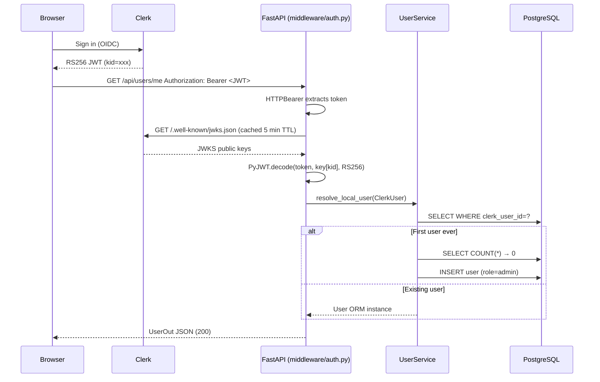
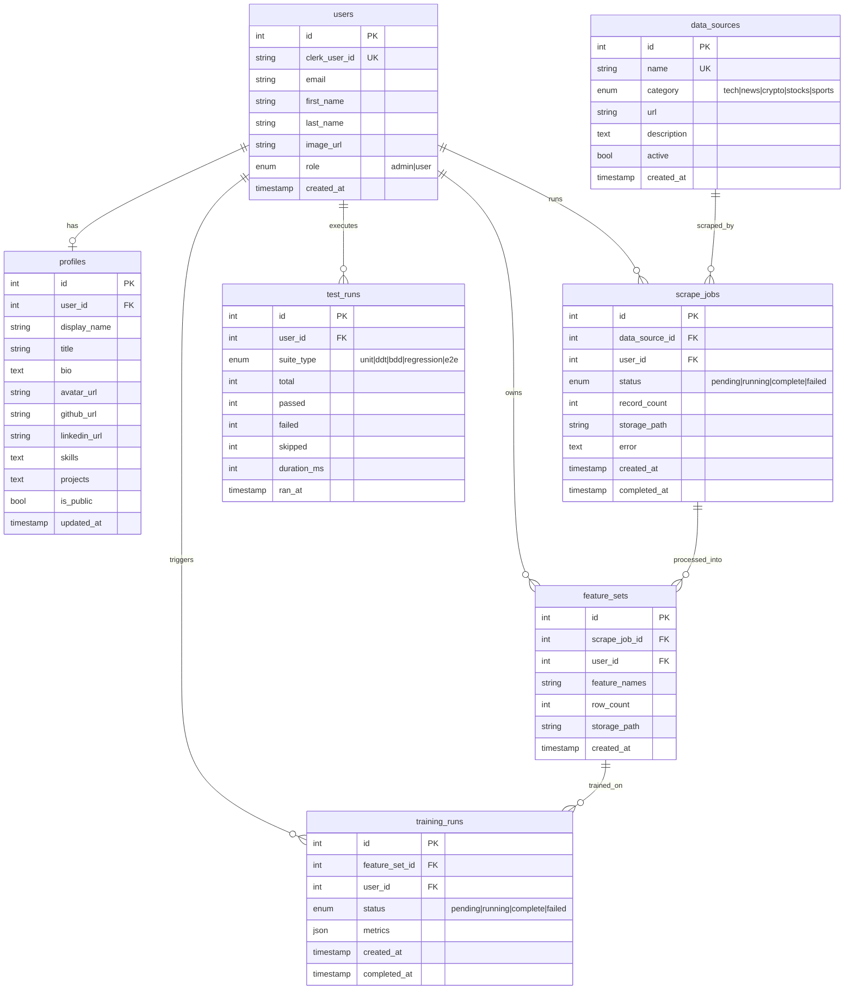
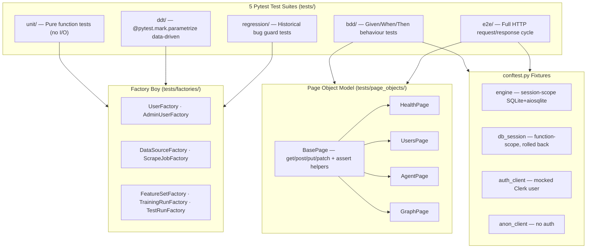

# Synaptiq — Architecture (v2.0.0 Python FastAPI Backend)

> **Synaptic Applications** — AI-native knowledge graph, agent pipeline, and analytics platform.
> Copyright © 2026 Synaptic Applications (Itkdaniel). MIT License.
>
> **v2.0.0** migrates the backend from TypeScript/Express → **Python 3.12 / FastAPI**
> while keeping the TypeScript React frontend and OpenAPI contract unchanged.

---

## 1. System Overview



---

## 2. Python Backend — FastAPI Application Structure



---

## 3. Agent Pipeline — Scrape → Process → Train



---

## 4. Auth & RBAC — Clerk JWT (PyJWT + JWKS)



---

## 5. Database Schema (SQLAlchemy 2.0 / PostgreSQL 16)



---

## 6. Testing — Page Object Model + Factory Boy



---

## 7. Docker — Dev vs Production

| | Dev (`docker/dev/`) | Prod (`docker/prod/`) |
|---|---|---|
| **Dockerfile** | `docker/dev/Dockerfile` | `docker/prod/Dockerfile` (multi-stage) |
| **Compose** | `docker-compose.dev.yml` | `docker-compose.prod.yml` |
| **API mode** | `uvicorn --reload --log-level debug` | `uvicorn --workers 4 --log-level info` |
| **Frontend** | Vite dev server (HMR on port 3000) | Nginx serving pre-built `/dist` |
| **Database** | Local PG container | Managed cloud DB / self-hosted PG |
| **Source** | Volume-mounted (hot reload) | COPY into image at build time |
| **Security** | Open CORS, debug=true | Tightened CSP, debug=false |
| **Python stage** | Single stage (includes dev deps) | Multi-stage: builder venv → slim runtime |

---

## 8. CI/CD Pipeline

```
push to main / typescript-backend
    │
    ├── lint-py (ruff) ─────────────────────────────────────────────► ✅
    ├── typecheck-ts (tsc --noEmit) ────────────────────────────────► ✅
    │
    ├── test-py ← needs lint-py ────────────────────────────────────► ✅
    │       ├── unit tests
    │       ├── DDT tests
    │       ├── BDD tests
    │       ├── regression tests
    │       └── E2E tests + coverage → Codecov
    │
    ├── build-ts ← needs typecheck-ts ──────────────────────────────► ✅
    │       └── uploads platform/dist artifact
    │
    ├── docker-dev ← needs test-py ─────────────────────────────────► ✅
    └── docker-prod ← needs test-py + build-ts ─────────────────────► ✅
```

---

## Key Architecture Decisions

| Decision | Rationale |
|---|---|
| **FastAPI over Flask/Django** | Native async/await, Pydantic v2 auto-validation, auto OpenAPI docs, fastest Python ASGI |
| **SQLAlchemy 2.0 async + asyncpg** | True async I/O, no greenlet thread pool, best PostgreSQL performance |
| **Alembic migrations** | Explicit versioned migration history; replaces Drizzle `push` (no migration files) |
| **Factory pattern (BaseService)** | All services extend `BaseService[ModelT]`; factory classmethods centralise record creation |
| **Factory Boy for tests** | Declarative, composable, Faker-backed; mirrors the TypeScript factory test pattern |
| **Page Object Model** | HTTP interactions encapsulated per router; tests read as business-language assertions |
| **SQLite + aiosqlite in tests** | In-memory isolation, rolled back per function; no live DB required in CI |
| **First user = admin** | Count users BEFORE insert; prevents race-condition role promotion bug |
| **PyJWT + JWKS cache (5 min)** | Avoids per-request Clerk roundtrip; refreshes for key rotation |
| **OpenAPI contract preserved** | Same spec → TypeScript React Query hooks work without any frontend changes |
| **Separate dev/prod Docker** | Different base images, volumes, security posture; no prod debug tools in images |
