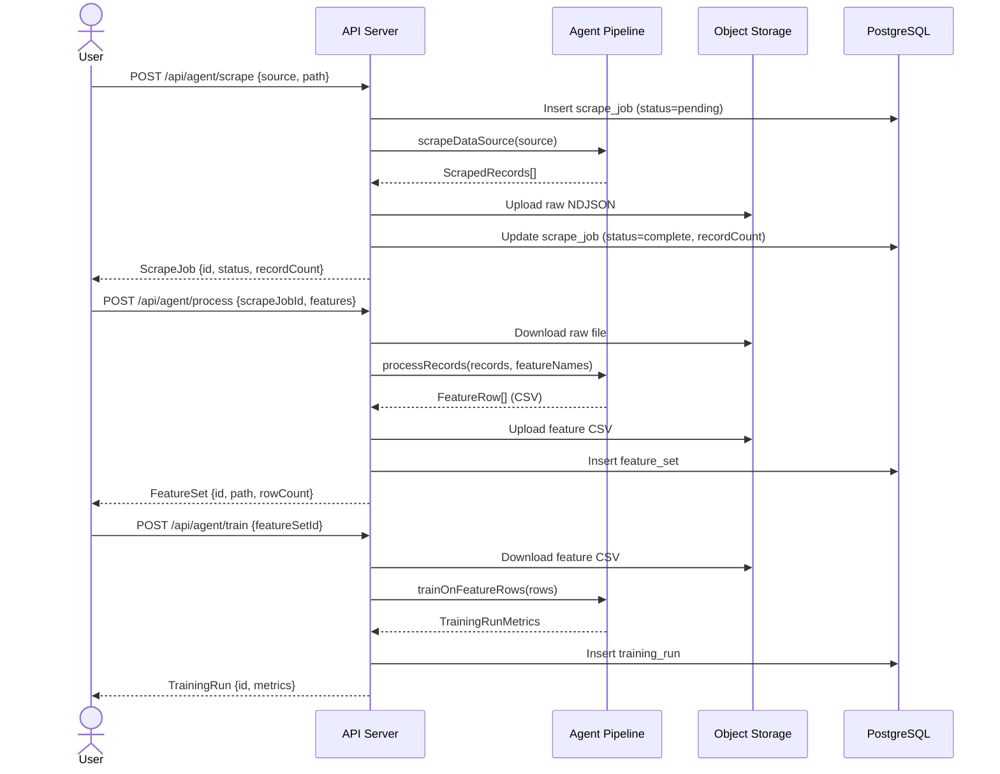
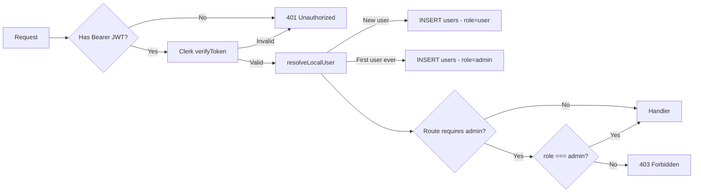
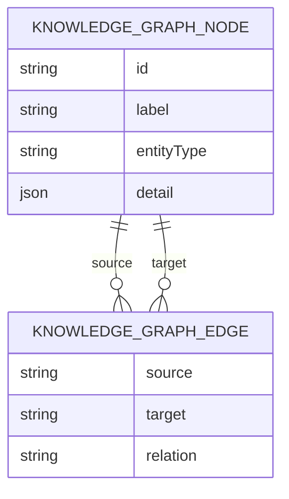
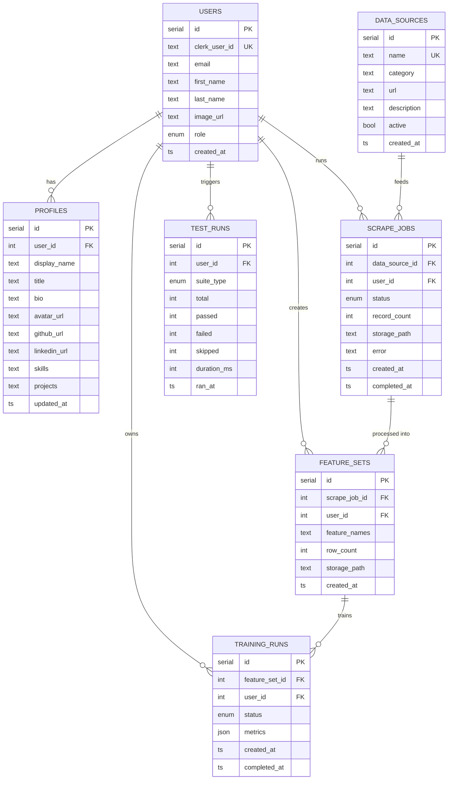

# Synaptiq — Architecture

> Copyright (c) 2026 Synaptic Applications (Itkdaniel). MIT License.

## System Overview

```mermaid
graph TB
    subgraph Client["Browser Client (React + Vite)"]
        UI[Pages / Components]
        RQ[React Query hooks]
        Clerk_FE[Clerk SDK - Auth]
    end

    subgraph Proxy["Replit Reverse Proxy (path routing)"]
        PR["/  → platform:23633"]
        PA["/api → api-server:5000"]
        PK["/clerk → Clerk JWKS proxy"]
    end

    subgraph API["API Server (Express 5 + Node 24)"]
        MW_Auth[Clerk middleware - JWT verify]
        MW_RBAC[RBAC middleware - admin/user]
        R_Health[/api/healthz]
        R_Users[/api/users]
        R_Profile[/api/profile]
        R_Agent[/api/agent]
        R_Tests[/api/tests]
        R_KG[/api/knowledge-graph]
        R_Storage[/api/storage]
    end

    subgraph DB["PostgreSQL (Drizzle ORM)"]
        T_Users[(users)]
        T_Profiles[(profiles)]
        T_DataSources[(data_sources)]
        T_ScrapeJobs[(scrape_jobs)]
        T_FeatureSets[(feature_sets)]
        T_TrainingRuns[(training_runs)]
        T_TestRuns[(test_runs)]
    end

    subgraph Pipeline["Agent Pipeline (lib/agent-pipeline)"]
        Scraper[Scraper - HN / NewsAPI / CoinGecko]
        Processor[Feature Processor - CSV]
        Trainer[Trainer - trend model]
    end

    subgraph Storage["Object Storage (Replit)"]
        OS[Bucket - raw / features / models]
    end

    UI --> RQ --> Proxy
    Proxy --> API
    Proxy --> Client
    MW_Auth --> MW_RBAC --> R_Users & R_Profile & R_Agent & R_Tests & R_KG
    R_Agent --> Pipeline --> OS
    R_Agent & R_Users & R_Profile & R_Tests & R_KG --> DB
```

## Service Ports

| Service        | Port  | Path  | Description                      |
|---------------|-------|-------|----------------------------------|
| api-server    | 5000  | /api  | Express REST API + Clerk proxy   |
| platform      | 23633 | /     | React SPA (Vite dev server)      |

## Package Layout

```
artifacts-monorepo/
├── artifacts/
│   ├── api-server/      # Express 5 backend (TypeScript, esbuild → CJS)
│   └── platform/        # React 18 + Vite SPA
├── lib/
│   ├── agent-pipeline/  # Scrape / process / train logic (TypeScript)
│   ├── api-client-react/# Generated React Query hooks (Orval)
│   ├── api-spec/        # OpenAPI 3.1 spec + Orval codegen config
│   ├── api-zod/         # Generated Zod schemas (Orval)
│   ├── db/              # Drizzle ORM schema + client
│   └── object-storage-web/ # Replit object storage client
├── scripts/             # CLI tools (agentCli.ts)
├── utils/               # Shell / PowerShell dev utilities
├── docker/              # Docker Compose + Nginx config
├── docs/                # Architecture, schema, API docs
└── .github/workflows/   # CI/CD (ci.yml, deploy-production.yml, codeql.yml)
```

## Data Flow — Agent Pipeline



## Authentication & RBAC



## Knowledge Graph Schema



## Database Schema



## Security Protocols

| Layer                  | Control                                                       |
|------------------------|---------------------------------------------------------------|
| Auth                   | Clerk-issued JWTs, verified server-side on every request      |
| Transport              | HTTPS enforced (Replit proxy + Nginx TLS in production)       |
| RBAC                   | `requireAuth` + `requireAdmin` Express middleware             |
| Supply-chain           | `minimumReleaseAge: 1440` in pnpm-workspace.yaml             |
| SAST                   | GitHub CodeQL on push / weekly schedule                       |
| Secrets                | Never in source — loaded via Replit Secrets or `.env.local`   |
| DB access              | Server-only via Drizzle; no direct DB exposure to browser     |
| CORS                   | `credentials: true, origin: true` (same-domain proxy)        |
| HTTP headers           | Nginx: X-Frame-Options, X-Content-Type-Options, CSP           |
| Docker                 | Non-root user (`synaptiq`), health checks, minimal Alpine base|
